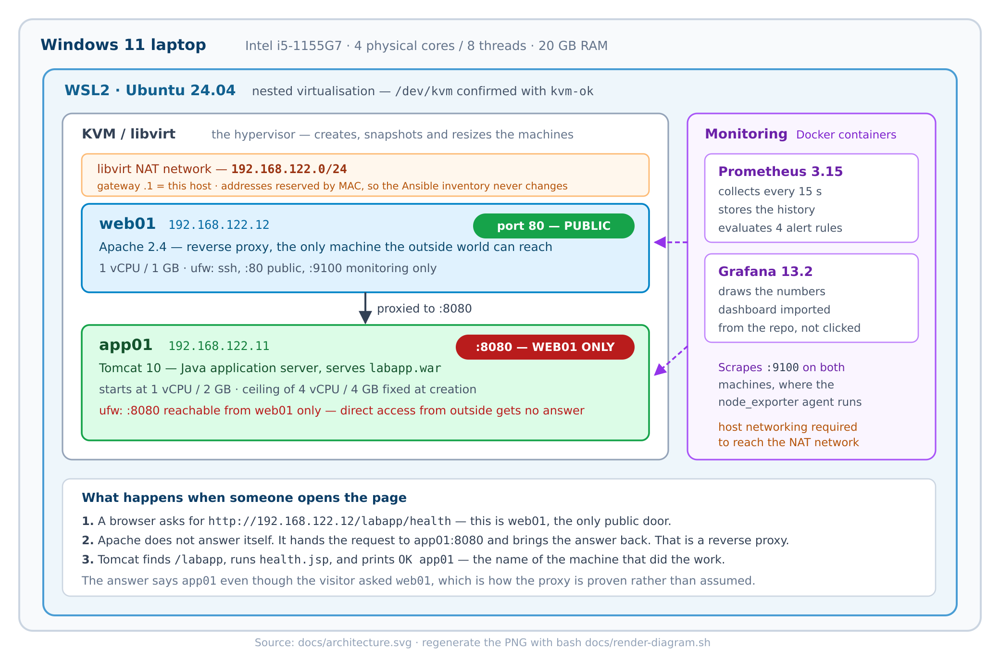

# kvm-tomcat-lab

**A two-tier Java application tier built on virtual machines — from an empty host
to a tested disaster recovery plan.**

Two Linux VMs. Apache reverse-proxies to Tomcat 10. Everything is built and
configured by Ansible, backed up with checksum-verified restores, monitored with
Prometheus and Grafana, and sized with a real load test.

The interesting part is not that it works. It is that **every claim below is
measured output from the running lab**, including the eight things that broke on
the way.



---

## The results

| What was tested | Result | Output |
|---|---|---|
| Build and configure both machines from one command, twice | second run: **`changed=0`** across 18 tasks | [evidence](docs/evidence/01-idempotency.txt) |
| Recover from **total VM loss** | **5 min 48 s** to a working service | [write-up](docs/disaster-recovery.md) |
| Backup restores onto a machine that never had the app | **`RESTORE VERIFIED: 5 files match`** | [evidence](docs/evidence/03-backup-restore-verified.txt) |
| The backup checker rejects a corrupted backup | **`RESTORE MISMATCH`**, exit 1 | [evidence](docs/evidence/04-backup-failure-drill.txt) |
| Scale the app VM from 1 to 4 vCPU | **17.9 → 44.1 requests/sec** (2.46×) | [analysis](docs/capacity-planning.md) |
| Only one door open to the outside | direct `app01:8080`: no answer | [evidence](docs/evidence/02-proxy-vs-direct.txt) |
| Roll back a bad change without rebooting | **5.1 s**, content hash unchanged | [write-up](docs/snapshots-and-resize.md) |

## What this is

Two virtual machines on a Linux host, talking over a private network:

- **web01** runs Apache. It is the only machine the outside world can reach, on
  port 80. It does not serve the application; it forwards requests to app01 and
  brings the answers back.
- **app01** runs Tomcat 10, serving a small Java web application from a WAR file.
  It starts at 1 vCPU so that the load test has a real bottleneck to find.

The machines are not configured by hand. A single Ansible playbook describes what
each machine should look like, and running it twice changes nothing the second
time. That property — *idempotency* — is what makes the setup reproducible instead
of a list of commands somebody ran once.

Around that core: a nightly backup whose restore is verified by checksum, a
firewall that makes the two-tier design real rather than decorative, Prometheus
and Grafana watching both machines, and a load test that produced an actual
capacity-planning result.

## How a request flows

1. A browser asks for `http://192.168.122.12/labapp/health`. That is **web01**.
2. Apache does not answer. It hands the request to `app01:8080` — a **reverse
   proxy** — and passes the answer back untouched.
3. Tomcat finds the `/labapp` application, runs `health.jsp`, and prints
   `OK app01`.

The reply says `app01` even though the visitor asked `web01`. That is how the
proxy is *proven* rather than assumed.

## Why two machines instead of one

A single machine could do both jobs. Splitting them buys four things that a real
system needs:

- **One public door.** The application server is not directly reachable, which
  the firewall enforces and the evidence above shows.
- **One place for security.** TLS, in a real deployment, is configured once at the
  proxy. The app server never handles certificates.
- **One place for logs and rate limiting.** Every request passes one point.
- **Room to grow sideways.** Adding a second app machine later is a change to
  Apache's configuration, not a redesign.

## What's worth a closer look

If you are reading this to judge the engineering rather than the result, these are
the parts that took thought:

- **The backup verifies a restore, not an archive.** It unpacks the archive into a
  scratch directory and compares checksums against a manifest from the source,
  because checksumming the archive only proves the file did not rot — not that it
  contains the application. [details](docs/backup-and-restore.md)
- **The backup refuses to run on an empty directory.** Two empty manifests compare
  equal, so an unguarded tool prints `RESTORE VERIFIED: 0 files match` forever
  while protecting nothing. During this build the deployment directory really was
  empty for a while. [details](docs/backup-and-restore.md)
- **The firewall rules are ordered deliberately.** Every "allow" is applied before
  the default-deny policy is switched on, because reversed, the first thing an
  empty deny ruleset kills is the SSH session running the playbook.
- **The capacity result is analysed for what it rules out**, not just reported.
  app01 pinned at 100% CPU at every size, web01 at 14%, the host never above 56% —
  which together say the application is the bottleneck and neither the proxy tier
  nor host exhaustion explains the sublinear scaling.
  [analysis](docs/capacity-planning.md)
- **Grafana's datasource and dashboard come from the repository**, not from
  clicking in a UI, so a fresh clone comes up working.

## Stack

KVM / libvirt · cloud-init · qcow2 · Ansible · Apache 2.4 · Tomcat 10 (Jakarta EE)
· JSP · systemd timers · bash · tar + SHA-256 integrity verification · rsync ·
Prometheus · Grafana · Docker Compose · ufw · git

Host: Windows 11 + WSL2 Ubuntu 24.04 with nested virtualisation.
Built and tested on Ubuntu 24.04 LTS.

## Reproduce

Takes about 20 minutes on a machine with virtualisation support. Steps 1 and 2 are
in [docs/host-setup.md](docs/host-setup.md) in more detail.

```bash
# 1. KVM host: hypervisor, tools, and the Ubuntu cloud image
sudo apt-get install -y qemu-system-x86 qemu-utils libvirt-daemon-system \
  libvirt-clients virtinst cpu-checker zip
sudo systemctl enable --now libvirtd

# 2. Two VMs with fixed addresses, built from the cloud image
bash scripts/create-vms.sh

# 3. Build the app and configure both machines
bash app/build.sh
ansible-playbook site.yml

# 4. It answers, through the proxy
curl http://192.168.122.12/labapp/health
# OK app01
```

Optional, in rough order of interest:

```bash
bash scripts/backup-failure-drill.sh    # prove the backup checker rejects bad input
bash scripts/capacity-test.sh           # the load test sweep from the results table
bash scripts/capture-evidence.sh        # regenerate docs/evidence/ yourself
cd monitoring && docker compose up -d   # Prometheus :9090, Grafana :3000
bash monitoring/import-dashboard.sh     # Node Exporter Full dashboard
bash docs/study-guide/build-pdf.sh      # rebuild the PDFs below
```

## What broke

Written up properly in [the build log](docs/build-log.md) and in plain English in
the study guide. Five worth knowing, because each one is a mistake worth not
repeating:

1. **A guard that could never say "no".** The safety check deciding whether to
   delete a network bridge used `pgrep -x qemu-system-x86_64`. Linux truncates
   process names to 15 characters, so that never matches, the negation is always
   true, and the "safety" check would have deleted the network out from under
   running VMs. It looked correct in review.
2. **An idempotency proof that was quietly false.** `zip` writes extra metadata, so
   rebuilding an unchanged WAR produced a different file and the deploy task
   reported `changed` forever. The checklist was fine; the input was not stable.
3. **Guests being power-cycled between commands.** WSL tears down the Linux user
   space when the last session closes, which kills the VM manager and the VMs with
   it. Found by noticing that kernel boot messages repeated while `boot_id` and
   uptime stayed constant — two facts that could not both be true.
4. **A dropped SSH connection that looked like an empty directory.** The error
   output had been sent to `/dev/null`. An empty listing was mistaken for evidence,
   and several turns went into a theory that did not exist.
5. **A hot-added CPU that stayed asleep.** libvirt reported 2 vCPUs, the guest
   reported 1. The kernel had logged `ACPI: CPU1 has been hot-added` and then left
   the CPU offline. The obvious verification step fails silently.

## Limitations

A portfolio project that lists no weaknesses is not credible.

- **Single host, no high availability.** One app VM. If it is down, the site is
  down. A firewall is not redundancy.
- **The performance numbers describe a laptop.** Nested virtualisation on an
  i5-1155G7 with 4 physical cores. The method and the shape of the curve transfer;
  the absolute figures do not.
- **The off-VM backup copy is on the same physical machine.** It survives losing
  the VM, which is tested, not losing the host, which is not.
- **In this lab the backup is not the only copy.** The WAR is also in git, so the
  playbook alone restored a working service in the 348-second test. A truer test
  of "the backup was all I had" needs state that git does not hold.
- **Lab-grade settings** that would not ship: host key checking disabled in
  `ansible.cfg`, Grafana on `admin/admin`, no secrets management, SSH open to any
  address, no TLS.
- **Not tested on VMware or Hyper-V.** The tooling used was KVM; the concepts map,
  as the table in [the study guide](docs/kvm-tomcat-lab-study-guide.pdf) sets out.

## Where to read more

- **[Study guide (PDF, 42 pages)](docs/kvm-tomcat-lab-study-guide.pdf)** — every
  tool explained from zero: what it is, why it was needed here, and where you meet
  it in a real job. Sources in [`docs/study-guide/`](docs/study-guide/).
- **[Complete documentation (PDF, 92 pages)](docs/kvm-tomcat-lab-complete.pdf)** —
  the guide plus this README plus every write-up plus the raw evidence.
- [Build log](docs/build-log.md) — module by module, in order, with what broke.
- [Host setup](docs/host-setup.md) · [Snapshots and resizing](docs/snapshots-and-resize.md)
  · [Backup and restore](docs/backup-and-restore.md) ·
  [Capacity planning](docs/capacity-planning.md) · [Hardening](docs/hardening.md) ·
  [Disaster recovery](docs/disaster-recovery.md)
- [Raw evidence](docs/evidence/) — the command output behind every number above.

## Repository layout

```
.
├── ansible.cfg, inventory.ini, site.yml    the playbook and its address book
├── app/                    health.jsp, work.jsp, web.xml, build.sh -> labapp.war
├── roles/
│   ├── common/             apt cache, curl, htop, rsync
│   ├── tomcat/             Tomcat 10, deploys the WAR, health-checked
│   ├── apache/             reverse proxy virtual host
│   ├── backup/             verified backup script, systemd service + timer
│   ├── node_exporter/      metrics agent
│   └── hardening/          ufw rules matching the two-tier design
├── monitoring/             Prometheus, Grafana, alert rules, dashboard import
├── scripts/                create-vms, capacity-test, evidence, DR helpers
└── docs/
    ├── kvm-tomcat-lab-study-guide.pdf     plain-English guide to every tool
    ├── kvm-tomcat-lab-complete.pdf        everything in one document
    ├── architecture.svg / .png            the diagram above
    ├── study-guide/                       guide sources, one file per chapter
    ├── evidence/                          raw output behind every claim
    └── ...                                the write-ups listed above
```

## Status

All nine build modules are complete, and the definition of done is signed off:

- [x] Both VMs run and are reachable over key-only SSH
- [x] `ansible-playbook site.yml` twice, second run `changed=0`
- [x] `curl` through Apache returns `OK app01`
- [x] Snapshot taken, deliberate breakage, revert works (5.1 s)
- [x] Live vCPU and memory resize shown with `nproc` and `free -m`
- [x] Backup shows `RESTORE VERIFIED`; tamper drill shows `RESTORE MISMATCH`
- [x] Backup copied off the VM and checksum-verified
- [x] Prometheus targets `up`, Grafana dashboard working
- [x] Load test table filled in with measured numbers
- [x] Disaster recovery drill: total VM loss to working service in 348 s
- [x] Reviewed README, evidence and a plain-English study guide

## License

Apache License 2.0. See [LICENSE](LICENSE).
